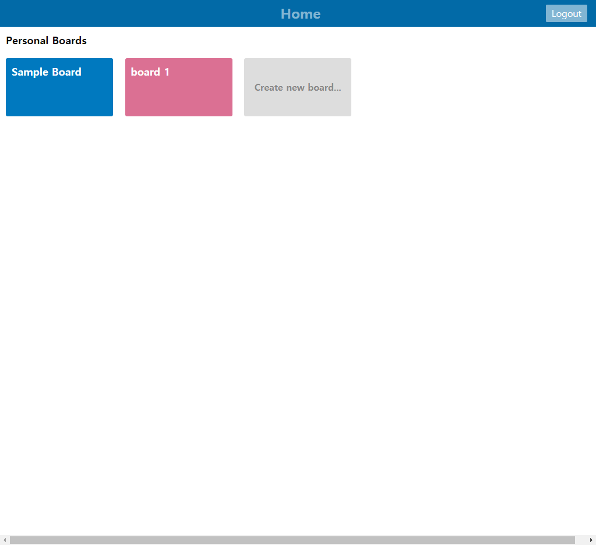
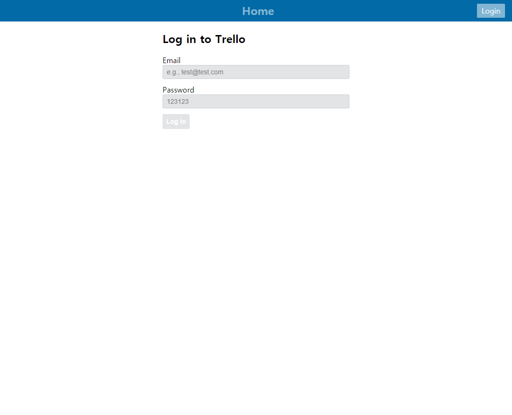
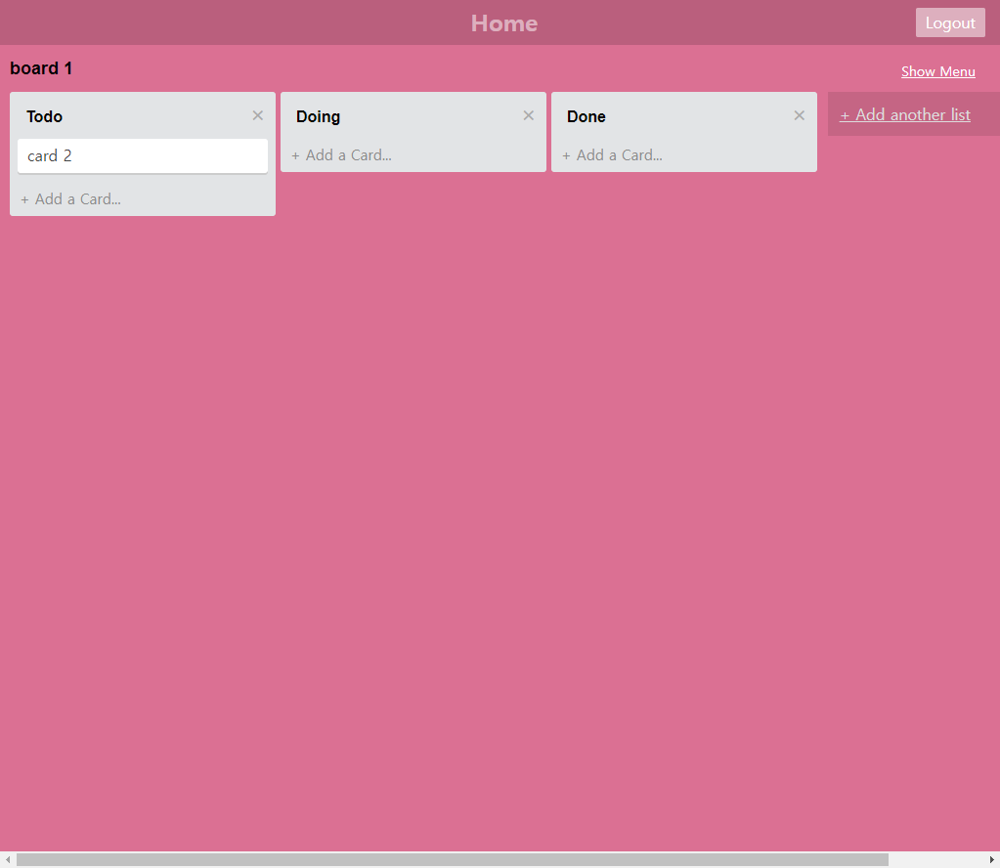
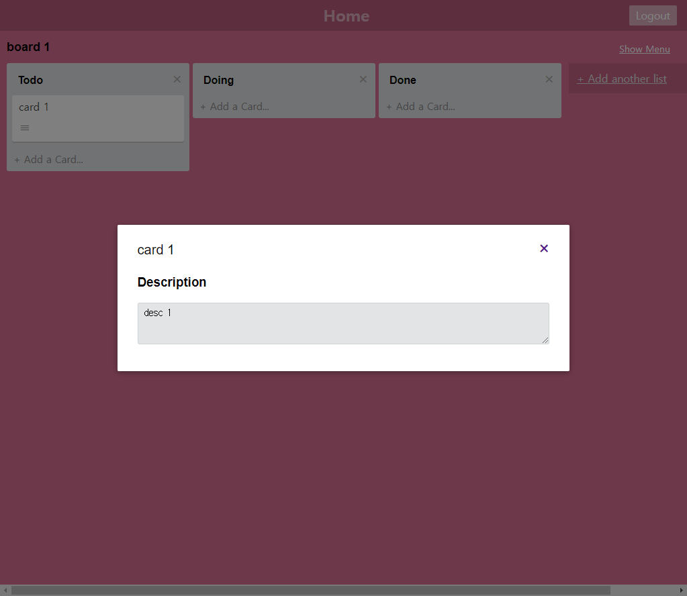

# ✔Vue로 만드는 칸반 보드📍[Kanban board with Vuejs]

## 📌Table of Contents

- [✔Vue로 만드는 칸반 보드📍[Kanban board with Vuejs]](#vue로-만드는-칸반-보드kanban-board-with-vuejs)
  - [📌Table of Contents](#table-of-contents)
  - [💻Demo](#demo)
  - [📷Screenshots](#screenshots)
  - [🔰How to Start?](#how-to-start)
  - [🎐Features](#features)

## 💻Demo

    
GIF Demo
    
    

## 📷Screenshots

    
Home

    

    
Login

    

    
Board

    

    
Card

    

## 🔰How to Start?

1. clone this project - `https://github.com/CaesiumY/vue-with-kanban-board.git`
2. run command to start - `npm start`
3. clone backend repo - `https://github.com/jeonghwan-kim/lecture-vue-trello-server.git`
4. run command to start backend - `npm run dev`
5. Refresh frontend page
6. PROFIT!

## 🎐Features
`Read` is always possible, of course.

- [x] board
  - [x] Create
  - [x] Delete

- [x] Lists
  - [x] Create
  - [x] Update (title)
  - [x] Delete
  - [x] Drag
  - [x] Change Theme Color

- [x] Cards
  - [x] Create
  - [x] Update (title, description)
  - [x] Delete
  - [x] Drag

- [x] Auth
  - [x] Login
  - [x] Logout
  - [x] Remember Login
    - Watch out! tokens will be stored in your `local storage`