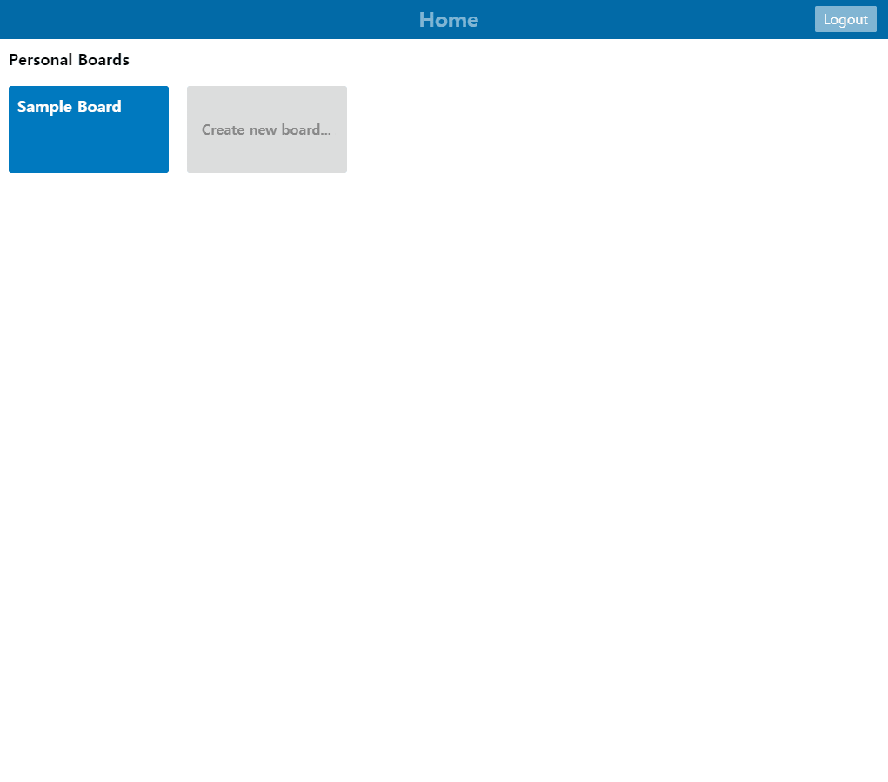

# ✔Vue로 만드는 칸반 보드📍

## 📌Table of Contents

- [✔Vue로 만드는 칸반 보드📍](#vue로-만드는-칸반-보드)
  - [📌Table of Contents](#table-of-contents)
  - [💻Demo](#demo)
  - [📷Screenshots](#screenshots)

## 💻Demo

    
GIF Demo
    
    

## 📷Screenshots

    
Home

    

    
Login

    

    
Board

    

    
Card

    

